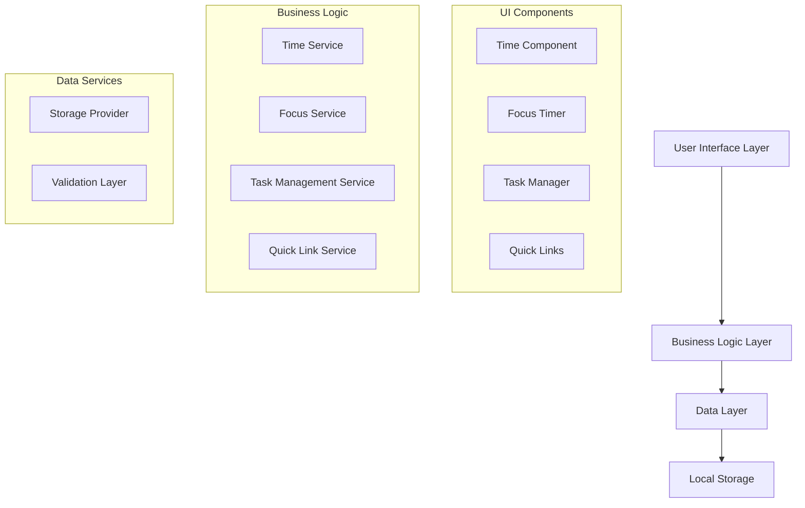

# Design Document: To-Do List Life Dashboard

## Overview

The To-Do List Life Dashboard is a client-side web application that provides an integrated productivity workspace combining time awareness, task management, focus timing, and quick website access. The system operates entirely in the browser using vanilla HTML, CSS, and JavaScript with Local Storage for data persistence.

### Key Design Principles

- **Client-Side Only**: No backend dependencies, all functionality runs in the browser
- **Minimal Dependencies**: Pure vanilla web technologies without external libraries
- **Persistent State**: Local Storage ensures data survives browser sessions
- **Responsive Design**: Clean, distraction-free interface optimized for productivity
- **Performance First**: Sub-100ms interactions with efficient DOM updates

### Core Components

1. **Time Display & Greeting System**: Real-time clock with contextual greetings
2. **Focus Timer**: 25-minute Pomodoro-style countdown timer
3. **Task Management**: CRUD operations for to-do items with completion tracking
4. **Quick Links**: Customizable website shortcuts for rapid navigation
5. **Data Persistence Layer**: Local Storage abstraction with error handling

## Architecture

### System Architecture

The application follows a modular, event-driven architecture with clear separation of concerns:



### Component Interaction Flow

1. **Initialization**: App loads → Storage Provider reads Local Storage → Services initialize with persisted data → UI renders current state
2. **User Actions**: UI captures events → Business Logic processes → Data Layer validates and persists → UI updates reflect changes
3. **Timer Updates**: Focus Timer and Time Display use `setInterval` for periodic updates without blocking other operations

### Error Handling Strategy

- **Graceful Degradation**: If Local Storage fails, app continues with in-memory state
- **Input Validation**: All user inputs validated before processing
- **Storage Quota**: Handle quota exceeded errors with user notification
- **Browser Compatibility**: Feature detection with fallback messaging

## Components and Interfaces

### Time Display Component

**Purpose**: Provides real-time clock and contextual greeting functionality

**Interface**:
```javascript
class TimeDisplay {
  constructor(containerElement)
  start()                    // Begin real-time updates
  stop()                     // Stop updates
  getCurrentGreeting()       // Returns appropriate greeting string
  formatTime(date)          // Returns formatted time string
  formatDate(date)          // Returns formatted date string
}
```

**Responsibilities**:
- Update display every second using `setInterval`
- Calculate appropriate greeting based on current time
- Format time and date for display
- Handle timezone considerations

### Focus Timer Component

**Purpose**: Implements 25-minute Pomodoro-style focus sessions

**Interface**:
```javascript
class FocusTimer {
  constructor(containerElement)
  start()                    // Begin countdown
  stop()                     // Pause countdown
  reset()                    // Reset to 25 minutes
  getRemainingTime()         // Returns seconds remaining
  formatTime(seconds)        // Returns MM:SS format
  onComplete(callback)       // Register completion handler
}
```

**State Management**:
- `IDLE`: Timer at 25:00, ready to start
- `RUNNING`: Actively counting down
- `PAUSED`: Stopped but retains current time
- `COMPLETED`: Reached 00:00, notification shown

### Task Management Component

**Purpose**: Handles CRUD operations for to-do items

**Interface**:
```javascript
class TaskManager {
  constructor(containerElement, storageProvider)
  addTask(text)              // Create new task
  editTask(id, newText)      // Update task text
  toggleComplete(id)         // Toggle completion status
  deleteTask(id)             // Remove task
  getTasks()                 // Return all tasks
  renderTasks()              // Update DOM display
}
```

**Task Data Structure**:
```javascript
{
  id: string,           // Unique identifier (timestamp-based)
  text: string,         // Task description
  completed: boolean,   // Completion status
  createdAt: Date,      // Creation timestamp
  completedAt: Date     // Completion timestamp (if applicable)
}
```

### Quick Links Component

**Purpose**: Manages customizable website shortcuts

**Interface**:
```javascript
class QuickLinks {
  constructor(containerElement, storageProvider)
  addLink(name, url)         // Create new quick link
  deleteLink(id)             // Remove quick link
  openLink(url)              // Open URL in new tab
  validateUrl(url)           // Validate URL format
  getLinks()                 // Return all links
  renderLinks()              // Update DOM display
}
```

**Link Data Structure**:
```javascript
{
  id: string,           // Unique identifier
  name: string,         // Display name
  url: string,          // Target URL
  createdAt: Date       // Creation timestamp
}
```

### Storage Provider

**Purpose**: Abstracts Local Storage operations with error handling

**Interface**:
```javascript
class StorageProvider {
  save(key, data)            // Persist data to Local Storage
  load(key)                  // Retrieve data from Local Storage
  remove(key)                // Delete data from Local Storage
  isAvailable()              // Check Local Storage availability
  handleQuotaExceeded()      // Handle storage quota errors
}
```

**Storage Keys**:
- `todo-dashboard-tasks`: Task collection
- `todo-dashboard-links`: Quick links collection
- `todo-dashboard-settings`: User preferences (future use)

## Data Models

### Task Model

```javascript
class Task {
  constructor(text) {
    this.id = `task-${Date.now()}-${Math.random().toString(36).substr(2, 9)}`;
    this.text = text;
    this.completed = false;
    this.createdAt = new Date();
    this.completedAt = null;
  }
  
  toggle() {
    this.completed = !this.completed;
    this.completedAt = this.completed ? new Date() : null;
  }
  
  updateText(newText) {
    this.text = newText;
  }
  
  toJSON() {
    return {
      id: this.id,
      text: this.text,
      completed: this.completed,
      createdAt: this.createdAt.toISOString(),
      completedAt: this.completedAt ? this.completedAt.toISOString() : null
    };
  }
  
  static fromJSON(data) {
    const task = new Task(data.text);
    task.id = data.id;
    task.completed = data.completed;
    task.createdAt = new Date(data.createdAt);
    task.completedAt = data.completedAt ? new Date(data.completedAt) : null;
    return task;
  }
}
```

### Quick Link Model

```javascript
class QuickLink {
  constructor(name, url) {
    this.id = `link-${Date.now()}-${Math.random().toString(36).substr(2, 9)}`;
    this.name = name;
    this.url = this.normalizeUrl(url);
    this.createdAt = new Date();
  }
  
  normalizeUrl(url) {
    // Add https:// if no protocol specified
    if (!/^https?:\/\//i.test(url)) {
      return `https://${url}`;
    }
    return url;
  }
  
  isValidUrl() {
    try {
      new URL(this.url);
      return true;
    } catch {
      return false;
    }
  }
  
  toJSON() {
    return {
      id: this.id,
      name: this.name,
      url: this.url,
      createdAt: this.createdAt.toISOString()
    };
  }
  
  static fromJSON(data) {
    const link = new QuickLink(data.name, data.url);
    link.id = data.id;
    link.createdAt = new Date(data.createdAt);
    return link;
  }
}
```

### Timer State Model

```javascript
class TimerState {
  constructor() {
    this.duration = 25 * 60; // 25 minutes in seconds
    this.remaining = this.duration;
    this.status = 'IDLE'; // IDLE, RUNNING, PAUSED, COMPLETED
    this.intervalId = null;
  }
  
  start() {
    if (this.status === 'COMPLETED') return false;
    this.status = 'RUNNING';
    return true;
  }
  
  pause() {
    this.status = 'PAUSED';
  }
  
  reset() {
    this.remaining = this.duration;
    this.status = 'IDLE';
    if (this.intervalId) {
      clearInterval(this.intervalId);
      this.intervalId = null;
    }
  }
  
  tick() {
    if (this.status !== 'RUNNING') return;
    
    this.remaining--;
    if (this.remaining <= 0) {
      this.remaining = 0;
      this.status = 'COMPLETED';
      return true; // Indicates completion
    }
    return false;
  }
  
  getFormattedTime() {
    const minutes = Math.floor(this.remaining / 60);
    const seconds = this.remaining % 60;
    return `${minutes.toString().padStart(2, '0')}:${seconds.toString().padStart(2, '0')}`;
  }
}
```

## Correctness Properties

*A property is a characteristic or behavior that should hold true across all valid executions of a system-essentially, a formal statement about what the system should do. Properties serve as the bridge between human-readable specifications and machine-verifiable correctness guarantees.*

### Property 1: Date Formatting Consistency

*For any* valid Date object, the time display formatting function SHALL produce a human-readable string containing day, month, and year components in a consistent format.

**Validates: Requirements 1.1**

### Property 2: Time-Based Greeting Accuracy

*For any* time of day, the greeting system SHALL return "Good Morning" for times 5:00-11:59 AM, "Good Afternoon" for times 12:00-5:59 PM, and "Good Evening" for times 6:00 PM-4:59 AM.

**Validates: Requirements 1.3, 1.4, 1.5**

### Property 3: Timer State Transitions

*For any* valid timer state and any valid starting time value, starting the timer SHALL transition it to running state and begin countdown from the current value.

**Validates: Requirements 2.2**

### Property 4: Timer Pause Preservation

*For any* running timer with any remaining time value, pausing the timer SHALL preserve the exact remaining time and allow resumption from that point.

**Validates: Requirements 2.3**

### Property 5: Timer Reset Consistency

*For any* timer state (idle, running, paused, or completed), resetting the timer SHALL return it to 1500 seconds (25 minutes) and idle state.

**Validates: Requirements 2.4**

### Property 6: Time Format Validation

*For any* number of seconds (0 to 1500), the timer formatting function SHALL produce a valid MM:SS string where MM is zero-padded minutes and SS is zero-padded seconds.

**Validates: Requirements 2.6**

### Property 7: Task Creation Integrity

*For any* non-empty text string, creating a task SHALL result in a new task object with that exact text, unique ID, creation timestamp, and incomplete status.

**Validates: Requirements 3.1**

### Property 8: Task Completion Toggle

*For any* task in any completion state, toggling its completion status SHALL change the completed flag to the opposite value and update the completion timestamp appropriately.

**Validates: Requirements 3.3**

### Property 9: Task Collection Removal

*For any* task collection and any task within that collection, deleting the task SHALL result in a collection that no longer contains that task and has a count reduced by one.

**Validates: Requirements 3.4**

### Property 10: Task Creation Order Preservation

*For any* sequence of task creation operations, the task list SHALL maintain and display tasks in the exact order they were created, regardless of subsequent modifications.

**Validates: Requirements 3.7**

### Property 11: Link Creation Validation

*For any* valid name string and URL string, creating a quick link SHALL result in a new link object with that name, normalized URL, unique ID, and creation timestamp.

**Validates: Requirements 4.1**

### Property 12: Link URL Opening

*For any* valid quick link with a properly formatted URL, activating the link SHALL attempt to open that exact URL in a new browser tab.

**Validates: Requirements 4.2**

### Property 13: Link Collection Removal

*For any* link collection and any link within that collection, deleting the link SHALL result in a collection that no longer contains that link and has a count reduced by one.

**Validates: Requirements 4.3**

### Property 14: URL Validation Accuracy

*For any* string input, the URL validation function SHALL correctly identify valid URLs (with or without protocol) and reject invalid formats, returning appropriate boolean results.

**Validates: Requirements 4.6**

### Property 15: Data Persistence Round-Trip

*For any* valid task or link collection, saving the data to storage and then loading it back SHALL result in an equivalent collection with all items preserving their properties and relationships.

**Validates: Requirements 3.5, 3.6, 4.4, 4.5, 5.2, 5.3, 5.4**

### Property 16: Invalid Data Graceful Handling

*For any* corrupted or invalid data format in storage, the initialization process SHALL detect the invalid data, initialize with empty collections, and log appropriate error information without crashing.

**Validates: Requirements 5.5**

## Error Handling

### Storage Error Management

**Local Storage Unavailability**:
- Detect Local Storage support during initialization
- Fall back to in-memory storage with user notification
- Gracefully handle quota exceeded errors
- Provide clear error messages for storage failures

**Data Corruption Handling**:
- Validate data structure on load
- Use try-catch blocks around JSON parsing
- Initialize with empty state if data is corrupted
- Log errors for debugging while maintaining functionality

**Network and Browser Compatibility**:
- Feature detection for required APIs
- Graceful degradation for unsupported browsers
- Clear error messages for missing functionality
- Fallback behaviors where possible

### Input Validation

**Task Input Validation**:
- Reject empty or whitespace-only task text
- Sanitize HTML content to prevent XSS
- Limit task text length to prevent storage issues
- Validate task IDs for uniqueness

**URL Validation for Quick Links**:
- Use URL constructor for validation
- Normalize URLs by adding protocol if missing
- Reject malicious or invalid URL schemes
- Validate URL length and format

**Timer Input Validation**:
- Ensure timer values are within valid ranges
- Validate state transitions are legal
- Prevent negative time values
- Handle edge cases like system clock changes

### User Interface Error Feedback

**Visual Error Indicators**:
- Red border highlighting for invalid inputs
- Toast notifications for operation failures
- Inline error messages for form validation
- Loading states during storage operations

**Error Recovery Options**:
- Retry buttons for failed operations
- Clear error state mechanisms
- Undo functionality for accidental deletions
- Export/import options for data recovery

## Testing Strategy

### Dual Testing Approach

The testing strategy combines property-based testing for core business logic with example-based testing for specific scenarios and integration points.

**Property-Based Testing**:
- Minimum 100 iterations per property test
- Focus on data transformation, validation, and business logic
- Use fast-check library for JavaScript property testing
- Each test references its corresponding design property
- Tag format: **Feature: todo-list-life-dashboard, Property {number}: {property_text}**

**Unit Testing**:
- Specific examples for edge cases and error conditions
- Integration points between components
- UI interaction scenarios
- Browser API mocking and error simulation

### Test Categories

**Core Logic Tests** (Property-Based):
- Time formatting and greeting calculation
- Timer state management and transitions
- Task and link CRUD operations
- Data serialization and validation
- Storage round-trip operations

**Integration Tests** (Example-Based):
- Local Storage integration with error scenarios
- DOM manipulation and event handling
- Timer interval management
- Cross-browser compatibility
- Performance benchmarks

**UI Tests** (Example-Based):
- User interaction flows
- Visual feedback and animations
- Responsive layout behavior
- Accessibility compliance
- Error message display

### Testing Tools and Configuration

**Property-Based Testing Setup**:
```javascript
// Using fast-check for property-based testing
import fc from 'fast-check';

// Example property test configuration
fc.configureGlobal({
  numRuns: 100,
  verbose: true,
  seed: 42 // For reproducible test runs
});
```

**Mock Strategy**:
- Mock Local Storage for controlled testing
- Mock Date/Time for deterministic time-based tests
- Mock DOM APIs for unit testing
- Mock browser APIs for compatibility testing

**Test Data Generation**:
- Generate random valid task text (non-empty strings)
- Generate random URLs (valid and invalid formats)
- Generate random time values within valid ranges
- Generate random collections of varying sizes

### Performance Testing

**Load Testing**:
- Test with large numbers of tasks (1000+)
- Test with many quick links (100+)
- Measure Local Storage operation performance
- Monitor memory usage during extended use

**Responsiveness Testing**:
- Verify sub-100ms interaction response times
- Test timer accuracy under load
- Measure DOM update performance
- Test smooth animations and transitions

### Browser Compatibility Testing

**Target Browser Matrix**:
- Chrome 90+ (primary target)
- Firefox 88+ (secondary target)
- Edge 90+ (secondary target)
- Safari 14+ (secondary target)

**Compatibility Test Scenarios**:
- Local Storage availability and behavior
- Timer precision and accuracy
- DOM API compatibility
- CSS feature support
- JavaScript API availability